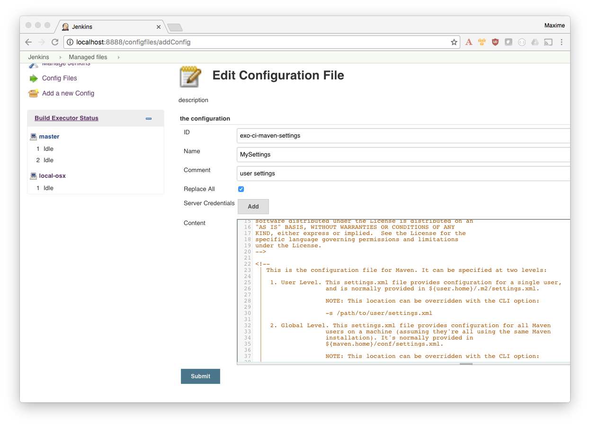

= Talk about Jenkins 2 Pipeline with Docker for Maven CI
:toc:
:toclevels: 4
:images: ./
ifdef::env-github[]
:status:
:outfilesuffix: .adoc
:!toc-title:
:caution-caption: :fire:
:important-caption: :exclamation:
:note-caption: :paperclip:
:tip-caption: :bulb:
:warning-caption: :warning:
endif::[]

This repository contains all resources about this talk:

* `*slides*`: sources for AsciiDoc slides
* `*docs*`: public files, slides HTML (assets, html...)
* `*demo*`: docker compose files and doc to run the demo

== How to work on slides with livereload feature?

. Start the container
+
[source]
----
$ docker-compose up -d
$ open http://localhost:8000
----
+
. Edit slides (`.adoc` files) in `slides/src/`
. Save
. Refresh your browser and enjoy ;)

== Run the Demo

=== Start Jenkins2 / Sonar containers

[source]
.Create a network
----
$ docker network create --driver bridge swf

# Run Sonar
# user: admin
# pwd: admin
$ docker-compose -f demo/sonar/docker-compose.yml up

# Run Jenkins
# user: administrator
# password: password4Admin
$ docker-compose -f demo/jenkins2/docker-compose.yml up
$ open http://localhost:8888

----

=== Configure the Jenkins instance

A lot of configuration is loaded by default in the `mgreau/jenkins` Docker image, but some configuration have to be done once Jenkins is started.

==== Create an Agent (ci-agent))

. Configure the agent so that it can access the Docker daemon, by configuring the agent startup
.. Go to  http://localhost:8888/computer/new to *create a new agent*
... Name:: `ci-agent`
... Description:: `Agent used to execute Build in Docker containers`
... Remote root directory:: `jenkins-agents/ci-agent`
+
[NOTE]
----
This is a path to your filesystem (here ~/jenkins-agents/ci-agent).
You can set an absolute path.
----
+
... Labels:: `*ci-docker*`
... Launch method:: `Launch slave agents on Unix machines via SSH`
.... Host:: `Your IP (no 127.0.0.1 neither localhost)`
.... Credentials:: *Add new credentials with your username/pwd*
.... Advanced >  Prefix Start Slave Command:: `source ~/.bash_profile  &&`
[IMPORTANT]
Required so that Jenkins can load your PATH to be able to access the docker binary

=== Configure a Gmail SMTP

In order to receive builds status by email, you need to configure, got to http://localhost:8888/configure#section20[Extended E-mail Notification Configuration]

[horizontal]
SMTP server:: smtp.gmail.com
Use SMTP Authentication:: YES
User Name:: YOUR EMAIL
Password:: Email Account Password (or app password if you have 2 key auth)
Use SSL:: YES
SMTP Port:: 465
Charset:: UTF-8

[NOTE]
====
If you don't do it, the pipeline will failed at the last step, but other steps will be ok.
====

=== Execute the default Pipeline/Maven/Docker build

By default, a Jenkns Pipeline job is created at http://localhost:8888/job/javaee7-websocket-master-ci/

It will build a Maven Java EE 7 project in a `exoplatform/ci:jdk8-maven32` Docker container.+

[IMPORTANT]
====
The first time you execute this job, it will failed for security reason.
You just have to http://localhost:8888/scriptApproval[Approve the Pipeline Script]
Then you can re-execute the pipeline.
====

=== Advanced configuration

==== Maven Settings file

If you want to customize the Maven Settings file included in each container:

. Update the Maven configuration file (settings.xml with ID *`exo-ci-maven-settings`*)
.. Go to http://localhost:8888/configfiles/editConfig?id=exo-ci-maven-settings
.. Update the Maven XML config file with your configuration
+

+

==== Create your first Pipeline Docker job

. Create a new job
.. Name::
.. Type:: pipeline
. Submit
. Configure
.. Pipeline script
[source,groovy]
----
@Library('github.com/mgreau/exo-pipeline-library@master') // <1>
import exoCI // <2>

node('ci-docker'){

    exoCI{
        gitUrl = 'https://github.com/mgreau/javaee7-websocket.git'
        gitBranch = 'master'
        dockerImage = 'exoplatform/ci:jdk8-maven32'
        mavenGoals = 'clean package'
    }
}
----
<1> This library is initialized in the default `mgreau/jenkins2` Docker image, so this line is not mandatory
<2> The functions are automatically loaded in the default `mgreau/jenkins2` Docker image,  so this line is not mandatory

== Misc commands

[source, shell]
----
$ docker image ls --filter=reference='mgreau/ci'
----