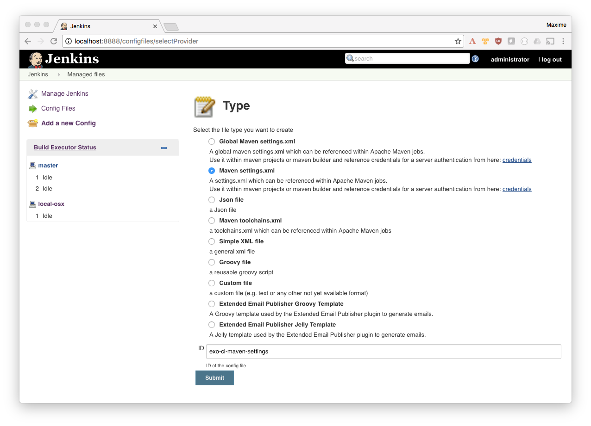

= Talk about Jenkins 2 Pipeline with Docker for Maven CI
:toc:
ifdef::env-github[]
:status:
:outfilesuffix: .adoc
:!toc-title:
:caution-caption: :fire:
:important-caption: :exclamation:
:note-caption: :paperclip:
:tip-caption: :bulb:
:warning-caption: :warning:
endif::[]

This repository contains all resources about this talk:

* `*slides*`: sources for AsciiDoc slides
* `*docs*`: public files, slides HTML (assets, html...)
* `*demo*`: docker compose files and doc to run the demo

== How to work on slides with livereload feature?

. Start the container
+
[source]
----
$ docker-compose up -d
$ open http://localhost:8000
----
+
. Edit slides (`.adoc` files) in `slides/src/`
. Save
. Refresh your browser and enjoy ;)

== Run the Demo

=== Start Jenkins2 / Sonar containers

[source]
.Create a network
----
$ docker network create --driver bridge swf

# Run Sonar
# user: admin
# pwd: admin
$ docker-compose -f demo/sonar/docker-compose.yml up

# Run Jenkins
# user: administrator
# password: password4Admin
$ docker-compose -f demo/jenkins2/docker-compose.yml up
$ open http://localhost:8888

----

=== Configure Jenkins for Docker/Maven

==== Maven Settings file

. Create a Maven configuration file (settings.xml) with the ID *`exo-ci-maven-settings`*
.. Go to http://localhost:8888/configfiles/selectProvider
.. [x] Maven Settings
.. ID: *exo-ci-maven-settings*
+

+
.. Then Add your Maven XML config file (or let the default config)
+
image::./demo/images/jenkins-setup-maven-config-xml.png[]
+

==== Docker configuration

. Create the `dockerRunParams` environment variable:
.. Got to http://localhost:8888/configure
.. [ ] `Environment variables`
... Name: *`dockerRunParams`*
... Value: *`-u 0:0`*
. Configure the agent to be able to access the Docker daemon by configuring the agent startup
.. Go to  http://localhost:8888/computer/new to *create a new agent*
... Name:: `ci-agent`
... Description:: `Agent used to execute Build in Docker containers`
... Remote root directory:: `jenkins-agents/ci-agent`
+
[NOTE]
----
This is a path to your filesystem (here ~/jenkins-agents/ci-agent).
You can set an absolute path.
----
+
... Labels:: `*ci-docker*`
[IMPORTANT]
Required to execute Docker build on this node
... Launch method:: `Launch slave agents on Unix machines via SSH`
.... Host:: `Your IP (no 127.0.0.1 neither localhost)`
.... Credentials:: *Add new credentials with your username/pwd*
.... Advanced >  Prefix Start Slave Command:: `source ~/.bash_profile  &&`
[IMPORTANT]
Required so that Jenkins can load your PATH to be able to access the docker binary
